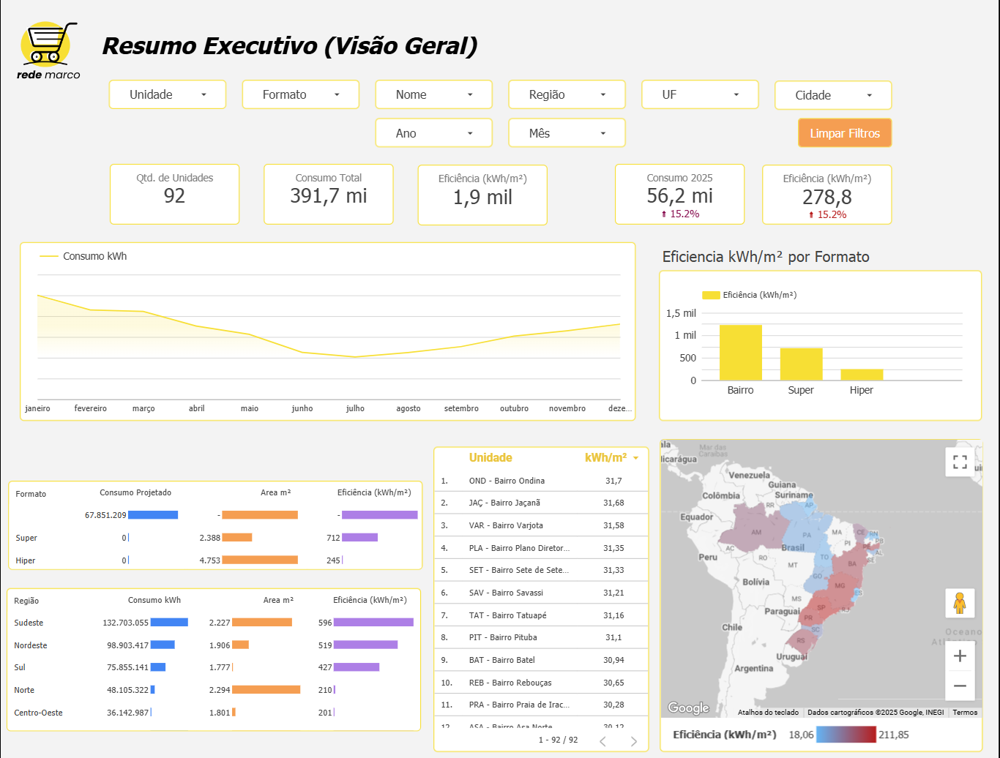

# Análise Preditiva e Otimização de Consumo de Energia para Rede de Varejo



## 📄 Resumo do Projeto

Este projeto apresenta uma solução completa de Business Intelligence e Análise Preditiva desenvolvida para uma rede fictícia de supermercados. O objetivo principal é monitorar, prever e otimizar o consumo de energia elétrica, traduzindo dados brutos em insights acionáveis e oportunidades de economia financeira.

A solução vai desde a criação de um dataset sintético e realista com Python até o desenvolvimento de um dashboard interativo no Looker Studio, que inclui um modelo de previsão de consumo e um simulador de cenários de economia.

## 📊 Dashboard Interativo

O resultado final do projeto é um dashboard interativo de 3 páginas, que permite uma análise completa do cenário de consumo de energia da empresa.

**[Acesse o dashboard completo e interativo aqui](https://lookerstudio.google.com/reporting/70a0371c-7d8f-4512-bce6-a38106fa19fe)**


## 🎯 O Problema de Negócio

A gestão de custos operacionais, como o de energia elétrica, é crucial para a saúde financeira de grandes redes de varejo. Sem uma análise detalhada e uma visão futura do consumo, a tomada de decisão para investimentos em eficiência energética se torna reativa e imprecisa.

Este projeto buscou responder às seguintes questões:
* Como está a performance de consumo de cada loja, considerando suas particularidades (tamanho, região)?
* Qual é a tendência de consumo para os próximos meses?
* Qual seria o impacto financeiro de se atingir determinadas metas de redução de consumo?

## ✨ Principais Funcionalidades

* **Dashboard Executivo:** Visão geral com os principais KPIs de consumo, custo e eficiência (kWh/m²).
* **Análise de Performance Ano-sobre-Ano:** Comparativo detalhado do consumo entre diferentes anos, com ranking de performance por loja.
* **Modelo de Previsão (Forecast):** Utilização da biblioteca Prophet (Facebook) para prever o consumo de cada loja individualmente para os meses seguintes.
* **Simulador Interativo de Economia:** Ferramenta que permite ao usuário final definir metas de economia e um custo por kWh para calcular o impacto financeiro projetado com base na previsão.

## 🛠️ Ferramentas e Tecnologias

* **Linguagem:** Python 3
* **Bibliotecas de Análise:** Pandas, Prophet
* **Ferramenta de BI:** Looker Studio (Google Data Studio)
* **Controle de Versão:** Git & GitHub

## ⚙️ Metodologia

O projeto foi estruturado em três etapas principais:

1.  **Geração de Dados Sintéticos (`gerador_dataset.py`):** Criação de um dataset detalhado para 92 lojas ao longo de 3 anos. O script simula um comportamento realista de consumo, incorporando fatores como sazonalidade (variações entre verão e inverno), tendências de crescimento anual e características individuais de cada loja (formato, área, região).

2.  **Modelagem Preditiva (`gerar_previsao.py`):** Desenvolvimento de um sistema de previsão granular. Um loop itera sobre cada uma das 92 lojas, treinando um modelo de séries temporais (Prophet) específico para o histórico daquela unidade. Os resultados (histórico + previsão) são consolidados em um único arquivo final.

3.  **Desenvolvimento do Dashboard (Looker Studio):** O dataset final e unificado foi utilizado como fonte de dados para a criação de um relatório interativo, com métricas calculadas, parâmetros de simulação e visualizações geográficas.

## 🚀 Como Executar o Projeto Localmente

Para executar os scripts e gerar os arquivos de dados, siga os passos abaixo.

**Pré-requisitos:**
* Python 3.x
* pip (gerenciador de pacotes do Python)

```bash
# 1. Clone o repositório
git clone https://github.com/guzzkj/datasets.git

# 2. Navegue até o diretório do projeto
cd datasets\Rede Marco - Portifólio

# 3. Instale as dependências necessárias
# (Recomendado: criar um ambiente virtual primeiro com 'python -m venv venv' e '.\venv\Scripts\activate')
pip install pandas prophet

# 4. Execute o script de geração de dados
# Este script cria o arquivo 'consumo_energia_supermercados_v2.csv'
python gerador_dataset.py

# 5. Execute o script de geração da previsão
# Este script lê o arquivo anterior e cria o 'dataset_final_com_previsao_por_loja.csv'
python gerar_previsao.py
```

## 👨‍💻 Autor

Projeto desenvolvido por **Gustavo Henrique Barros da Silva**.

* **LinkedIn:** [https://www.linkedin.com/in/gustavohbarros/](https://www.linkedin.com/in/gustavohbarros/)
* **Email:** [gustavobarros.ctt@gmail.com](mailto:gustavobarros.ctt@gmail.com)
